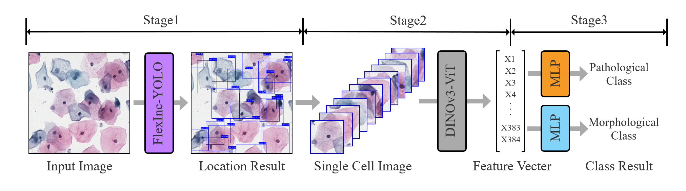

# A Three-Stage Analysis Framework for Cervical TCT Smears Based on FlexInc-YOLOv11 and DINOv3


Official open-source code for the paper published in **Applied Sciences (MDPI)**.

This repository provides the complete implementation of the proposed three-stage cervical cell analysis framework, including:
- Improved FlexInc-YOLOv11 detector with MSCA detection head
- DINOv3 feature extraction pipeline
- Lightweight MLP classification module

**Keywords**: Cervical TCT smears; YOLOv11; Multi-scale detection; DINOv3; Fine-grained classification; Medical image analysis

---

## 🔬 Overall Framework

The complete three-stage pipeline of the proposed framework:



1. **Stage 1 - Detection**: FlexInc-YOLOv11 detector localizes cells in TCT smear images
2. **Stage 2 - Feature Extraction**: Frozen DINOv3 backbone extracts robust semantic features
3. **Stage 3 - Classification**: Lightweight MLP head performs fine-grained classification

---

## 📝 Abstract

Cervical ThinPrep Cytologic Test (TCT) smear image analysis faces challenges including densely distributed cells, severe overlap, large scale variation, and subtle fine-grained differences among abnormal cells. To address these issues, this paper proposes a three-stage analysis framework combining an improved YOLOv11 detector and a frozen DINOv3 backbone.

---

## 🏆 Contributions

1. Propose a three-stage decoupled framework that separates detection, feature extraction, and fine-grained classification, better adapting to dense overlapping cell scenarios.
2. Present FlexInc-YOLOv11 detector with FlexInc modules and MSCA detection head, improving multi-scale and dense occlusion detection capability.
3. Adopt frozen DINOv3 backbone for feature extraction, effectively alleviating overfitting on small-sample medical data.
4. Design lightweight MLP classification head achieving dual fine-grained classification under pathological and morphological label standards.

---

## 🧠 Core Modules

### 1. FlexInc Module & MSCA Detection Head

Custom-designed modules for dense and overlapping cervical cell detection:

| Module | Description |
|--------|-------------|
| **FlexIncConv** | Multi-branch incremental convolution with directional sensitivity |
| **FlexIncBlock** | Feature fusion block for multi-scale cervical cell feature enhancement |
| **MSCA-Detect Head** | Multi-scale channel attention for dense occlusion regions |

### 2. DINOv3 Feature Extraction Pipeline

Frozen pre-trained DINOv3 backbone extracts high-level semantic features from cropped single-cell regions.

### 3. Lightweight Classification Heads

Multiple classifier architectures for efficient fine-grained classification.

---

## 📊 Experimental Results

### Detection Performance

| Metric | Value |
|--------|-------|
| Precision | 0.7860 |
| Recall | 0.7544 |
| F1-score | 0.7699 |
| mAP50 | 0.8426 |
| mAP75 | 0.6948 |
| mAP50-95 | 0.6350 |

### Classification Performance

**Pathological Classification Accuracy**: 87.36%
- 4 classes: Benign epithelial cells, Inflammatory response cells, Infection-related cells, Atypical/precancerous cells

**Morphological Classification Accuracy**: 89.19%
- 6 classes: Normal squamous cells, Abnormal squamous cells, Glandular cell-related cells, Inflammatory cells, Reactive/metaplastic cells, Other

### Visualization Results


---

## 📁 Repository Structure

```plaintext
Three-Stage-Cervical-TCT-Smear-Detection-Framework/
├── README.md                   # Project documentation
├── LICENSE                     # MIT License
├── requirements.txt            # Python dependencies
├── assets/                     # README image resources
│   └── figures/
│       ├── framework.png       # Framework diagram
│       ├── visual_result.png   # Visualization results
│       └── confusion_matrix.png # Confusion matrix
│
├── Stage1-FlexInc-YOLO/        # Stage 1: Detection Module
│   ├── train_yolo.py           # FlexInc-YOLOv11 training script
│   ├── detect.py               # Inference script
│   ├── yolov11s-FlexInc.yaml   # Model configuration file
│   ├── data/detection/         # Detection dataset directory
│   │   ├── train/              # Training set
│   │   └── val/                # Validation set
│   └── ultralytics/            # Modified YOLO framework
│       ├── cfg/                # Configuration files
│       ├── data/               # Data loading utilities
│       ├── engine/             # Training/validation engines
│       └── models/             # Model definitions
│
├── Stage2-DINOv3/              # Stage 2: Feature Extraction
│   ├── extract_dinov3_features.py  # DINOv3 feature extraction
│   ├── dinov3_vits16_pretrain.pth  # Pre-trained weights
│   ├── dinov3/                 # DINOv3 core modules
│   └── data/image/             # Cropped cell images
│       ├── train/              # Training set features
│       └── val/                # Validation set features
│
└── Stage3-Classifier/           # Stage 3: Classification Module
    ├── train_classifier.py     # Classifier training script
    ├── evaluate_classifier.py  # Classifier evaluation script
    ├── features/              # Extracted features (HDF5)
    │   ├── train/             # Training features
    │   └── val/               # Validation features
    └── models/                # Trained classifier models
```

---

## 🛠️ Environment Setup

### Hardware Environment

- **Operating System**: Ubuntu 22.04
- **GPU**: vGPU-48GB
- **CPU**: 12 vCPU Intel(R) Xeon(R) Platinum 8260
- **CUDA**: 12.8

### Software Dependencies

- **Python**: 3.12
- **Deep Learning Frameworks**: PyTorch, Ultralytics

### Installation Steps

```bash
# Clone the repository
git clone https://github.com/littlechicken139/Three-Stage-Cervical-TCT-Smear-Detection-Framework.git
cd Three-Stage-Cervical-TCT-Smear-Detection-Framework

# Install dependencies
pip install -r requirements.txt
```

---

## 🚀 Training & Testing Commands

### Stage 1: Train Detection Model

```bash
cd Stage1-FlexInc-YOLO
python train_yolo.py --data data/detection/cell_detection.yaml --cfg yolov11s-FlexInc.yaml --epochs 100 --batch-size 8
```

### Stage 1: Inference

```bash
cd Stage1-FlexInc-YOLO
python detect.py --weights runs/detect/train/weights/best.pt --source your_image_path --conf 0.5
```

### Stage 2: Extract DINOv3 Features

```bash
cd Stage2-DINOv3
python extract_dinov3_features.py --input_dir data/image/train --output_dir ../Stage3-Classifier/features/train
```

### Stage 3: Train Classification Model

```bash
cd Stage3-Classifier
python train_classifier.py --feature_dir features/train --output_dir models --classifier_type MLP
```

### Model Evaluation

```bash
cd Stage3-Classifier
python evaluate_classifier.py --feature_dir features/val --model_dir models --classifier_type MLP
```

---

## 📊 Dataset Description

The TCT cervical smear dataset used in this study was collected from **The First Affiliated Hospital of Zhengzhou University**, with strict anonymization to protect patient privacy:

| Attribute | Details |
|-----------|---------|
| **Patient Count** | dozens of independent patients |
| **Data Scale** | Training set: 2,460 TCT smear images with 112,439 annotations; Test set: 614 images with 30,044 annotations |
| **Imaging Device** | Medical biological microscope (Olympus BX53) |
| **Staining Method** | Pap staining |
| **Annotation Standard** | Annotated and double-checked by professional pathologists following TCT/Pap cytology standards |

**Note**: Due to medical privacy constraints, the raw dataset cannot be publicly released. We provide complete training code, model weights, and reproduction configuration for researchers.

> ⚠️ **Important**: The dataset included in this repository is solely a **sample** (a small portion of the full dataset) for code testing and validation purposes. The class categories and data quantities shown here are for reference only. They do not represent the complete dataset used in the paper.

---

## ⚡ Computational Overhead

| Model | Params (M) | FLOPs (G) | FPS |
|-------|-----------|-----------|-----|
| YOLOv11s | 7.18 | 14.8 | 92 |
| Ours (FlexInc-YOLOv11) | 7.92 | 16.3 | 85 |

---

## 📚 Citation

If this repository helps your research, please cite our paper:

```bibtex
@article{Liu2026TCT,
  title={A Three-Stage Analysis Framework for Cervical TCT Smears Based on FlexInc-YOLOv11 and DINOv3},
  author={Liu, Junfu and Gao, Binzhi and Wang, Xiaoyang and Liu, Ting and Zhu, Hong and Shi, Jing and Yang, Yi},
  journal={Applied Sciences},
  volume={16},
  number={X},
  pages={XXXX},
  year={2026},
  publisher={MDPI}
}
```

---

## 📄 License

This project is open-source under the **MIT License**. For academic research only.

---

## 📧 Contact

For questions regarding code usage and academic collaboration, please contact the corresponding authors:

- **Junfu Liu**
- **Binzhi Gao**
- **Xiaoyang Wang**
- **Ting Liu**
- **Hong Zhu**
- **Jing Shi**: shijing@xaut.edu.cn
- **Yi Yang**: yangyi@xaut.edu.cn

---

## 📝 Project Progress

- [x] Release Stage 1: FlexInc-YOLOv11 Detection Module
- [ ] Release Stage 2: DINOv3 Feature Extraction Module
- [ ] Release Stage 3: Lightweight MLP Classification Module
- [ ] Upload pre-trained model weights
- [ ] Add comprehensive documentation
